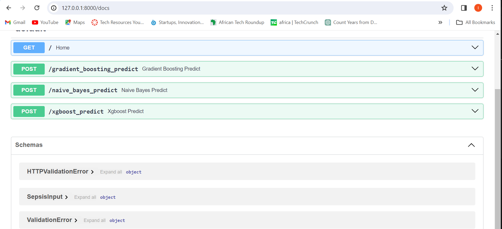
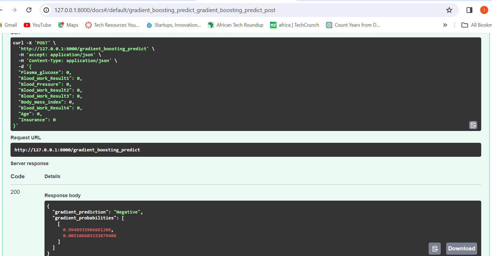
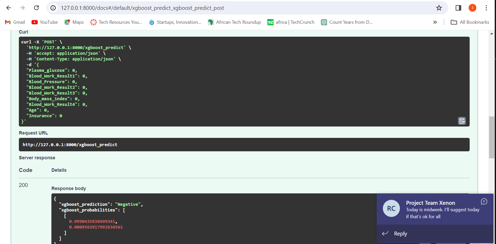
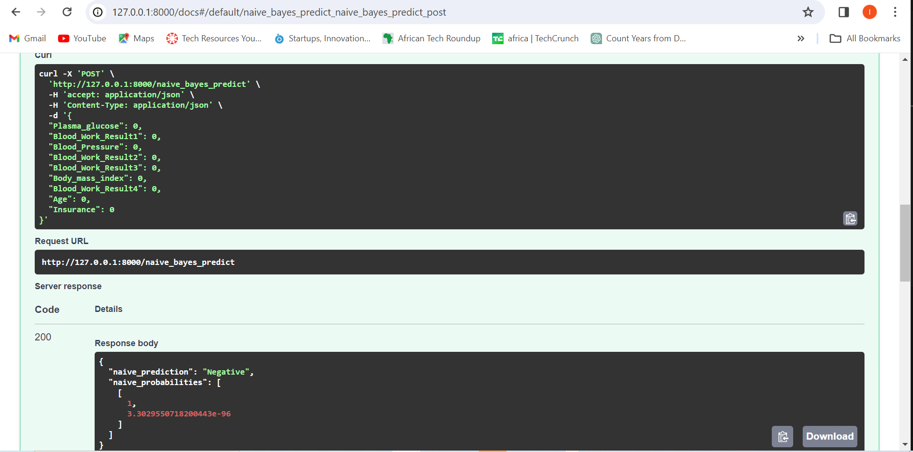

# Machine-Learning-API
This project aims to develop a machine learning API using the FastAPI web framework. The API is designed to predict patients with Sepsis based on the provided medical data. By leveraging machine learning models, healthcare professionals can potentially identify Sepsis cases earlier, leading to timely interventions and improved patient outcomes.

## Features
**Machine Learning Prediction:** Utilizes trained machine learning models to predict Sepsis based on input medical data.
**FastAPI Framework:** Built on FastAPI, a modern, fast web framework for building APIs with Python.
**Docker Deployment:** Enables easy deployment and scalability using Docker containers.

## Requirements
Python (3.11.8 recommended)
FastAPI
Docker
 
### Table of Contents
1. [Setup](#setup)
2. [Models Used](#models-used)
3. [Deployment](#deployment)
4. [Further Development](#further-development)
5. [Contributing](#contributing)
6. [License](#license)
 
### Setup 
 
1. **Clone Repository**: Clone the repository containing the machine learning api code.
2. **Install Dependencies**: Install the required dependencies using pip.
3. **Data Setup**: Ensure you have a CSV dataset named `paitients_Files_Train Dataset.csv` placed inside in the project directory.
4. **models**: The models are located in the `models` directory.

5. **main.ipynb**: This notebook contains `Data analysis` and building `model pipelines` construction processes.
6. **apy.py**: This script is the file where the API endpoints for various models  and is run using `uvicorn app:app -port 8002 --reload`. The application runs locally and outputs a URL to access it via a web browser by adding either `/docs or /redoc` to the base URL.

**API status code**: After running the `app.py` script in the browser, status codes are displayed to indicate whether the app is running without errors. These status codes provide feedback on the app's operational status.

**Prediction**: Users can perform predictions in the browser by testing different models with various input features.

 
### Models Used 
 
#### Supported Models
1. Gradient Boosting
2. XGBoost
3. Naive Bayes
 
#### Description
- Gradient Boosting: A machine learning ensemble method that builds strong predictive models by combining multiple weak models sequentially, where each new model corrects the errors of its predecessor.
- XGBoost: A powerful gradient boosting algorithm that enhances traditional gradient boosting with additional features like regularization, which improves both speed and performance.
- Naive Bayes: A probabilistic classifier based on Bayes' theorem, assuming that features are independent, often used for text classification tasks.
 
#### Model Training
- Data Preprocessing
- Pipeline Creation
- Model Training
- Evaluation
 
#### Model Selection
- User Choice
- Performance Comparison

### Docker Deployment 

 **Dockerfile**: This file defines the creation of the Docker image. To build the Docker image, use the command `docker build -t machine-learning-api` .. To run a Docker container with the image, use the command `docker run --name sepsis-prediction-api -d -p 8002:8003 machine-learning-api`. 
- To push Docker image to Docker Hub, create a repository and then tag the image with `adeley` as the Docker Hub username with repository name `sepsis-prediction-api`using the following command:

`docker tag machine-learning-api:v1.0 adeley/sepsis-prediction-api:v1.0`

After tagging the image, push it to Docker Hub with:

`docker push adeley/sepsis-prediction-api:v1.0`

**Docker hub endpoint**: Access the docker image using this endpoint:

`docker pull adeley/sepsis-prediction-api:v1.0`
 
 
 

 ### Further Development 
 
- Model Tuning
- Model Expansion
- Model Monitoring
 
### Contributing 
 
Contributions are welcome! If you have any suggestions, feature requests, or bug reports, please open an issue or create a pull request.
 
### License 
 
This project is licensed under the MIT LICENSE. Feel free to use, modify, and distribute the code for personal and commercial purposes.